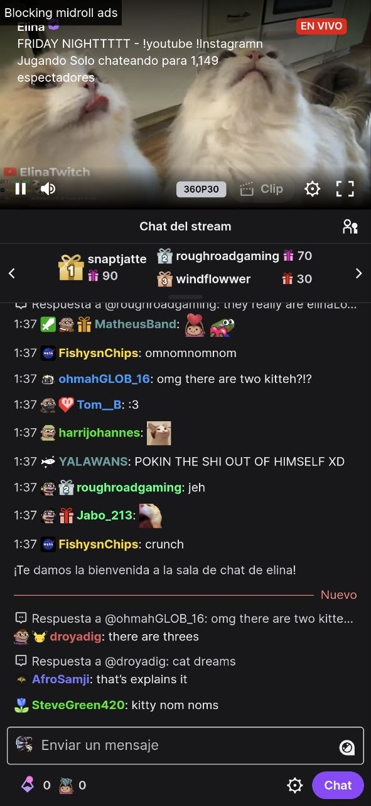

<p align="center">
  
</p>

<h1 align="center">Samtch</h1>

Samtch is a lightweight Twitch client for Android designed for a clean, ad-free viewing experience. It combines the power of the native Twitch web interface for discovery with a highly optimized custom player for watching.

## 🖼️ Gallery

| Discovery Browser | Following & Search |
| :---: | :---: |
|  |  |

| Custom Player (Portrait) | Fullscreen Mode |
| :---: | :---: |
|  |  |

| Ad-Blocking in Action | BTTV Integration |
| :---: | :---: |
|  |  |

## ✨ Features

- **Ad-Free Viewing**: Integrated scripts to bypass common video ads and tracking.
- **Clean UI**: Custom JavaScript injection removes "Open in App" prompts and clutters from the player interface.
- **Seamless Discovery**: Use the full Twitch mobile site for browsing, search, and following, while switching automatically to a native-feeling player when a stream is selected.
- **Smart Navigation**:
  - Automatically triggers the custom player when navigating to a live channel.
  - Allows full profile exploration (clips, videos, home tabs) without hijacking.
  - Remembers your browsing position when returning from the player.
- **Fullscreen Support**: Landscape mode with immersive system bar handling and optional side-chat overlay.
- **Gesture Controls**: Double-tap the center of the player to toggle chat in fullscreen mode.

## 🚀 Installation

You can download the latest version of Samtch from the **[Releases](https://github.com/akumasdk/Samtch/releases)** page.

1. Download the latest `.apk` file.
2. If prompted, enable "Install from Unknown Sources" in your Android settings.
3. Make sure to click **"Install anyway"** if a Play Protect dialog pops up during installation.
4. Open the file and install.

## 🛠️ Build Instructions

To build Samtch from source:

1. Clone the repository:
   ```bash
   git clone https://github.com/akumasdk/Samtch.git
   ```
2. Open the project in **Android Studio (Ladybug or newer)**.
3. Ensure you have the Android SDK for API 36 installed.
4. Build and run the project using the `app` configuration.

## 🤝 Contributing

Contributions are welcome! If you have ideas for improvements or have found a bug:

1. Fork the repository.
2. Create a new branch (`git checkout -b feature/amazing-feature`).
3. Commit your changes (`git commit -m 'Add amazing feature'`).
4. Push to the branch (`git push origin feature/amazing-feature`).
5. Open a Pull Request.

## 🗺️ Roadmap / Future Features

- [x] **Chat in Fullscreen**: Overlay chat during landscape viewing.
- [ ] **Navigation Improvements**: Faster transitions and better gesture support.
- [ ] **Picture-in-Picture (PiP)**: Watch streams while using other apps.
- [ ] **Android TV Support**: Optimized interface for television and remote control navigation.

## 🙏 Credits & Acknowledgments

- **[pixeltris/TwitchAdSolutions](https://github.com/pixeltris/TwitchAdSolutions)**: Special thanks for the `video-swap-new` script which powers the ad-blocking capabilities of this client.

---

*Disclaimer: Samtch is not affiliated with, maintained, authorized, endorsed, or sponsored by Twitch Interactive, Inc.*
